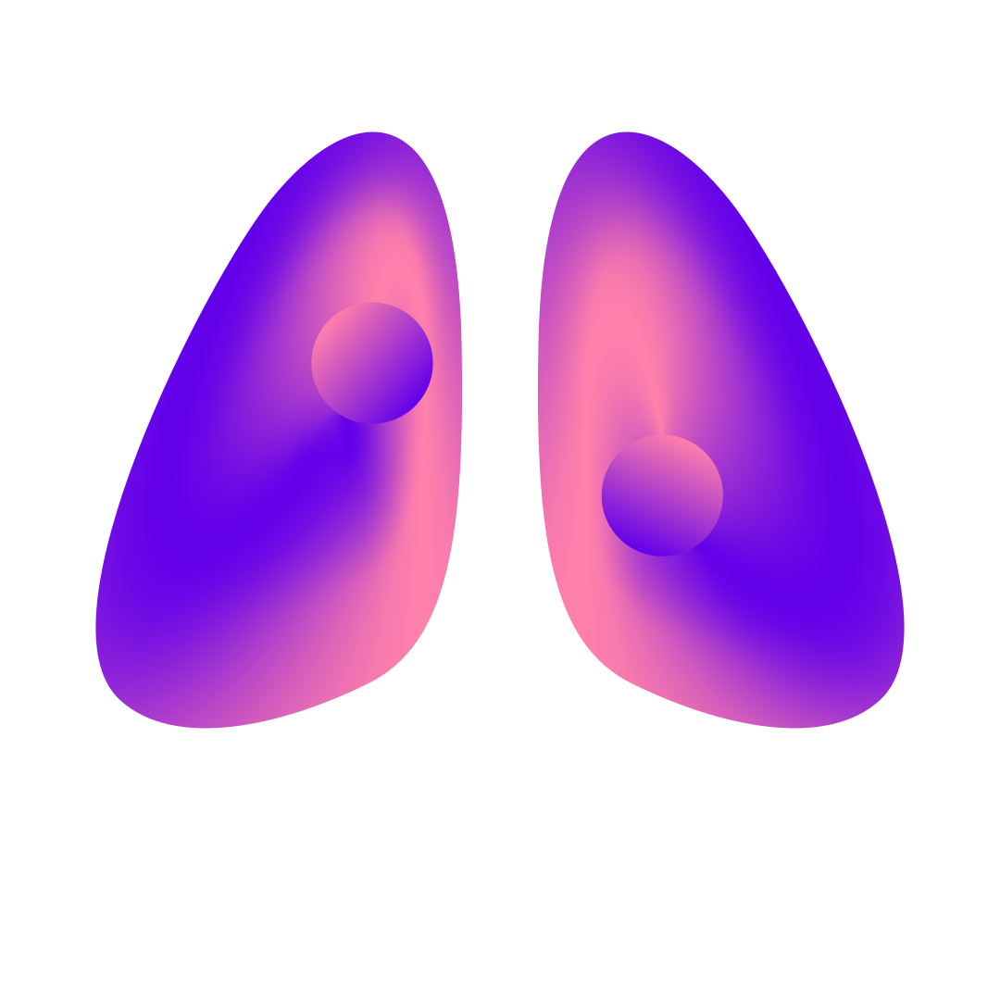
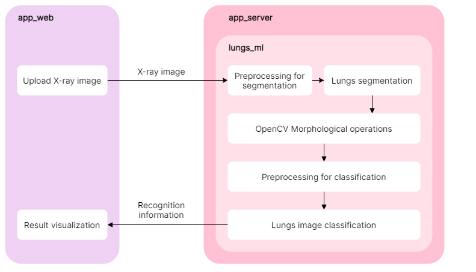
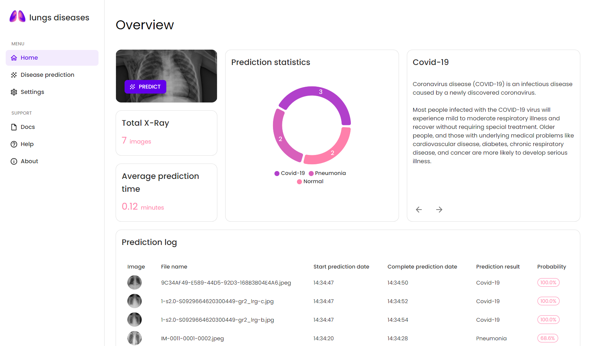
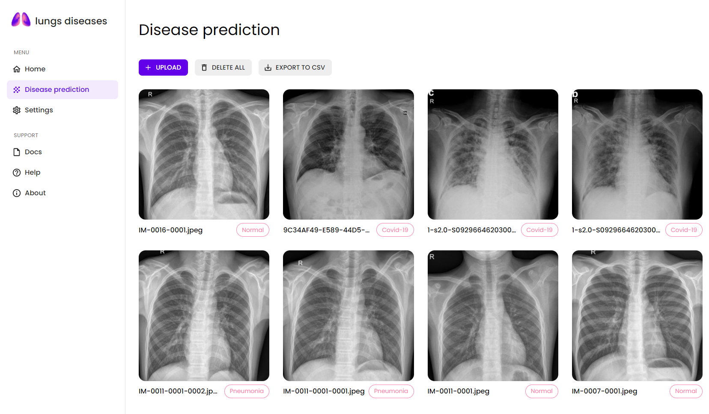

<div align='center'>
  

*Automatic detection of COVID-19 & pneumonia and lungs segmentation by X-ray images.*
</div>

## Structure

* ```app_bot``` - Telegram bot that performs COVID-19 & Pneumonia detection using ```lungs_ml``` as Python package.
* ```app_server``` - FastAPI application that implements prediction with ```lungs_ml``` as Python package.
* ```app_web``` - React application that sends uploaded images to the ```app_server``` and then displays the response.
* ```lungs_ml``` - Python package that implements the logic of image processing operations and their sequence, loading neural networks from files with weights.

<div align='center'>
  
</div>

## Models
Trained model files:
* Classification model:
  *  [ResNet weights](https://drive.google.com/uc?id=1-o6LfhM048dMyDxhLFLXsNchFF4GCfOM) (92 MB)
  *  [ResNet config](https://drive.google.com/uc?id=1KsH-Z5XjLptacug39DyBgbe8noLIdIOn) (84 KB)
* Segmentation model:
  *  [U-Net weights](https://drive.google.com/uc?id=1-IRkf-mwXdO9KnKPmyoRy38CHmLVTp2C) (122 MB)
  *  [U-Net config](https://drive.google.com/uc?id=1HCCDcX9Um0Iou88ZckMZKtQZ2mjJEfv6) (36 KB)

## Screenshots

<p align="center">
    <a href="//dumaevrinat.github.io/lantana">
      
      <br/><br/>
      
    </a>
</p>

## Setup and Running
* Clone the repo: ```git clone https://github.com/dumaevrinat/lung_diseases.git``` 

* **Web application**
  * Switch to ```app_web``` directory ```cd lung_diseases\app_web```
  * Create local env file ```.env.local``` and set ```REACT_APP_SERVER_BASE_URL``` variable
  * Install the dependencies ```npm install```
  * Run Web server ```npm start```, browse at ```http://localhost:3000```

* **API**
  * Switch to ```app_server``` directory ```cd lung_diseases\app_server```
  * Set the following environment variables:
    * ```ALLOWED_ORIGINS```
    * ```CLASSIFICATION_MODEL_WEIGHTS_PATH```
    * ```CLASSIFICATION_MODEL_CONFIG_PATH```
    * ```UNET_MODEL_WEIGHTS_PATH```
    * ```UNET_MODEL_CONFIG_PATH```
  * Install the dependencies ```pip install -r requirements.txt```
  * Run API server ```uvicorn app.main:app```

* **Telegram bot**
  * Switch to ```app_bot``` directory ```cd lung_diseases\app_bot```
  * Set the following environment variables:
    * ```BOT_TOKEN```
    * ```FONT_PATH```
    * ```CLASSIFICATION_MODEL_WEIGHTS_PATH```
    * ```CLASSIFICATION_MODEL_CONFIG_PATH```
    * ```UNET_MODEL_WEIGHTS_PATH```
    * ```UNET_MODEL_CONFIG_PATH```
  * Install the dependencies ```pip install -r requirements.txt```
  * Run Telegram bot ```python bot.py```

## License
All projects and packages in this repository are [MIT licensed](LICENSE).
